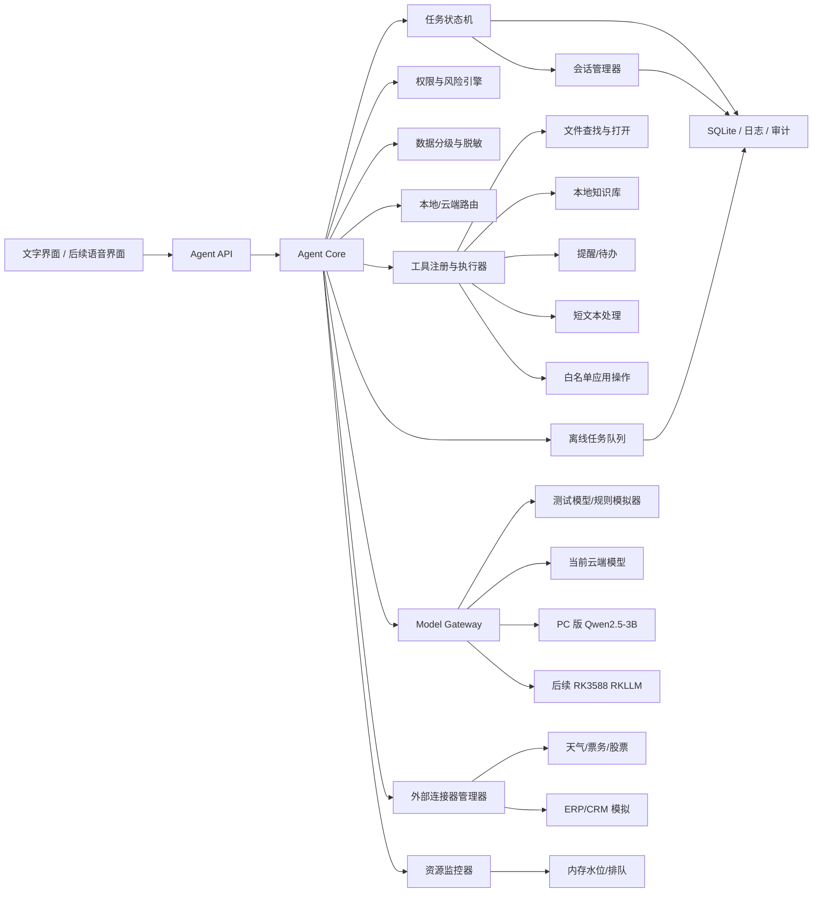

# 无硬件阶段 Agent 功能开发与 Qwen2.5-3B 适配架构

## 1. 总体结论

当前尚未取得目标硬件，仍然可以优先开发“硬件无关的 Agent 核心”。核心原则是：**Agent、工具和业务流程不绑定具体模型，Qwen2.5-3B-Instruct 只是后续可替换的推理引擎。**

现阶段应先完成模型网关、Agent 状态机、工具注册与校验、权限与风险控制以及自动化评测体系。后续获得 RK3588 硬件后，只需增加 RKLLM 模型适配器和硬件相关组件，不需要重写整体产品。

## 2. 推荐系统架构



开发时只允许 `Model Gateway` 接触具体模型。以后从云模型切换到 Qwen2.5-3B-Instruct 时，只替换模型适配器，不修改 Agent、工具和界面。

## 3. 模型适配器设计

模型能力应抽象为统一接口，例如：

```python
class ModelAdapter:
    async def generate(
        self,
        messages: list[dict],
        response_schema: dict,
        max_tokens: int,
    ) -> dict:
        ...
```

根据运行环境分别实现以下适配器：

| 适配器 | 用途 |
|---|---|
| `MockModelAdapter` | 自动化测试时不调用真实模型 |
| `CloudModelAdapter` | 当前阶段调用云端模型 |
| `QwenPcAdapter` | 在 PC 上验证 Qwen2.5-3B-Instruct |
| `RkllmAdapter` | 后续在 RK3588 上通过 RKLLM 推理 |

运行时通过配置切换模型：

```text
MODEL_PROVIDER=cloud
MODEL_PROVIDER=qwen_pc
MODEL_PROVIDER=rkllm
```

## 4. 当前可以优先开发的功能

| 优先级 | 功能 | 当前开发方式 | 后续接入 Qwen 的方式 |
|---|---|---|---|
| P0 | 统一任务入口 | 实现文字输入、任务编号和状态展示 | Qwen 负责理解请求 |
| P0 | 确认、取消和重试 | 完全由任务状态机实现 | 与模型无关 |
| P0 | 意图与参数提取 | 先接云模型或 Mock 模型，输出固定 JSON | 替换为 Qwen 输出 JSON |
| P0 | 工具注册中心 | 定义工具名称、参数 Schema、权限和超时 | Qwen 只负责选择工具 |
| P0 | 文件查找与打开 | 在 PC 目录中实现索引、候选确认和打开回执 | 可以直接迁移 |
| P0 | 提醒、日程与待办 | 使用 SQLite 和本地定时任务 | 可以直接迁移 |
| P0 | 短文本润色与消息草拟 | 当前使用云模型，并保留事实字段 | 后续由 Qwen 本地处理 |
| P0 | 本地知识库问答 | 实现文档解析、切片、向量检索和来源引用 | Qwen 只负责生成短答案 |
| P0 | 权限与风险规则 | 使用确定性规则和用户确认页面 | 不交给 Qwen 决定 |
| P0 | 本地/云端路由 | 按任务类型、数据等级和资源预算路由 | 后续增加硬件资源水位 |
| P0 | 日志与评测系统 | 保存输入、模型 JSON、工具结果和失败原因 | 用于模型回归评测和后续微调 |
| P1 | 会议纪要流程 | 先用上传的文字稿测试转写后的处理流程 | 后续接入 ASR 输出 |
| P1 | 实时天气、票务等查询 | 先实现合法 API 连接器 | Qwen 负责参数提取和结果表达 |
| P1 | 企业系统查询 | 先实现模拟连接器和权限模型 | 后续对接真实 ERP/CRM |
| 暂缓 | 唤醒词、麦克风阵列、近场 ASR/TTS | 依赖具体硬件和声学环境 | 获得板卡后验证 |
| 暂缓 | BLE、Matter、摄像头和 GPIO | 依赖具体外围器件 | 获得硬件后开发驱动层 |
| 暂缓 | RKLLM 性能与散热优化 | 必须在目标板上验证 | 硬件阶段完成适配 |

## 5. 首批 Agent 集成功能

第一版建议采用**一个 Agent 加多个确定性工具**，不建议一开始构建多 Agent 系统。

首批集成以下五项功能：

1. 授权文件查找与打开。
2. 本地知识库与制度查询。
3. 提醒、日程和待办。
4. 短文本润色与消息草拟。
5. 会议文字稿整理与纪要。

## 6. Agent 标准执行流程

```text
用户输入
  ↓
模型输出结构化意图和参数
  ↓
JSON Schema 校验
  ↓
权限与风险检查
  ↓
缺少参数时向用户确认
  ↓
确定性工具执行
  ↓
校验真实执行结果
  ↓
向用户展示结果和回执
```

模型输出建议统一为结构化格式：

```json
{
  "intent": "open_file",
  "arguments": {
    "keyword": "项目周报",
    "file_type": "docx"
  },
  "missing_fields": [],
  "confidence": 0.91
}
```

模型输出不能直接触发执行。Agent 必须继续检查：

- 工具是否已经注册。
- 参数是否合法。
- 用户是否具有操作权限。
- 是否存在多个候选对象。
- 是否需要二次确认。
- 工具是否真实执行成功。

## 7. Agent Core 核心模块

Agent Core 建议至少包含以下模块：

| 模块 | 主要职责 |
|---|---|
| Task API | 接收用户请求，创建任务编号 |
| Task State Machine | 管理接收、确认、执行、成功、失败、取消等状态 |
| Session Manager | 任务持久化、应用重启恢复、跨会话状态重建 |
| Model Gateway | 屏蔽云模型、PC 模型和 RKLLM 的接口差异 |
| Intent Parser | 将模型输出转换为统一任务结构 |
| Schema Validator | 校验意图、参数类型、必填字段和允许值 |
| Tool Registry | 注册工具、参数 Schema、权限和风险等级 |
| Tool Executor | 调用工具，处理超时、重试、取消和执行回执 |
| Policy Engine | 执行权限、角色、数据域和确认规则 |
| Data Classification Service | D0-D3 数据分级、敏感字段识别、脱敏策略、禁止外发清单 |
| Edge-Cloud Router | 综合工具可用性、数据等级、资源水位和网络状态选择执行端 |
| Offline Task Queue | 断网保留上下文和待同步状态，恢复后按版本和幂等继续 |
| Resource Monitor | 监控内存水位、CPU 占用、排队深度，触发转云或限流 |
| Connection Manager | 管理外部 API 连接器的认证、速率限制、故障降级和数据质量 |
| Audit Service | 保存输入、模型响应、工具调用和实际结果 |
| Evaluation Service | 使用固定样例进行模型和 Agent 回归测试 |

## 8. 为兼容 Qwen2.5-3B 提前落实的约束

Qwen2.5-3B-Instruct 是小型模型，Agent 设计不能依赖复杂、自由度过高的推理。当前阶段应落实以下约束：

- 每次只让模型完成一个明确步骤。
- 使用短提示词和固定 JSON Schema。
- 不依赖特定厂商的原生 Function Calling 格式。
- 首版工具数量控制在 3 至 5 个。
- 工具名称、参数和说明保持简短明确。
- 长文档先进行检索和切片，再把少量相关片段交给模型。
- 权限、路由、重试和成功判定全部使用程序规则。
- 保存固定评测集，确保更换模型后可以回归测试。
- Embedding、ASR 和 TTS 使用独立组件，不由 Qwen2.5-3B 承担。
- 首版不把模型微调作为开发前置条件。

## 9. 数据分级与脱敏设计

无硬件阶段必须完成数据分级框架和脱敏规则引擎，这是报告中"D3 凭据不得进入模型上下文"的工程落地。

### 9.1 四级数据分类

| 级别 | 定义 | 示例 | 允许上云 | 允许进模型上下文 |
|---|---|---|---|---|
| D0 | 公开信息 | 产品名称、公开文档标题 | 是 | 是 |
| D1 | 内部非敏感 | 内部项目代号、部门名称 | 脱敏后可上云 | 脱敏后可进入 |
| D2 | 内部敏感 | 客户名称、合同金额、未公开战略 | 否 | 片段可进入（不出端） |
| D3 | 凭据与密钥 | 密码、Token、API Key、生物特征 | 否 | 禁止进入 |

### 9.2 脱敏规则引擎

```python
class DataClassificationService:
    def classify(self, text: str) -> DataLevel: ...
    def sanitize(self, text: str, target_level: DataLevel) -> str: ...
    def check_outbound(self, data: dict, route_target: str) -> bool: ...
```

核心规则：

- 字段级规则：对已知字段（手机号、身份证、金额、API Key 模式）进行正则和命名实体识别
- 禁止外发清单：D3 字段硬编码禁止列表，任何路由决策前检查
- 脱敏策略：D1 可替换为类型标签（如 `[手机号]`），D2 默认不上云
- 语义识别辅助：模型可辅助识别敏感上下文，但最终判定由确定性规则执行

### 9.3 与路由器的协作

Edge-Cloud Router 在每次路由决策时，必须先调用 DataClassificationService.check_outbound()，确认拟发送数据不包含禁止外发字段。路由原因和实际出端数据范围必须记入审计日志。

## 10. 离线与韧性设计

### 10.1 离线任务队列

```python
class OfflineTaskQueue:
    async def enqueue(self, task_context: dict) -> str: ...
    async def dequeue(self) -> Task | None: ...
    async def sync_on_reconnect(self) -> list[Task]: ...
    async def get_queue_status(self) -> dict: ...
```

设计要点：

- 断网时用户请求不丢失，保存完整任务上下文到 SQLite
- 恢复网络后按 FIFO 顺序、版本检查和幂等键继续执行
- 队列任务在 UI 中显示"等待网络恢复"状态，支持用户手动取消
- 云端失败不得无限循环切换到本地，设置重试预算（默认 3 次）

### 10.2 会话持久化与恢复

Session Manager 在 Task State Machine 之下，保证应用重启后任务状态可重建：

- 每个任务的状态变更立即持久化到 SQLite（WAL 模式）
- 应用启动时扫描未完成的任务，恢复到内存状态机
- 已确认但未执行的任务继续执行
- 执行中的任务根据工具幂等键查询实际状态
- 超时任务标记为"需要用户关注"

### 10.3 资源监控器

无硬件阶段实现可配置的模拟资源监控器，后续替换为真实系统监控：

```python
class ResourceMonitor:
    def get_memory_watermark(self) -> float: ...
    def should_throttle(self) -> bool: ...
    def should_route_to_cloud(self, task: Task) -> bool: ...
    def get_queue_depth(self) -> int: ...
```

路由决策时，Resource Monitor 提供内存水位和排队深度，与 Data Classification、工具可用性共同决定执行端。

## 11. 推荐技术方案

PC 开发阶段可以采用以下轻量技术组合：

| 层级 | 推荐实现 |
|---|---|
| Agent 服务 | Python + FastAPI |
| 数据协议 | Pydantic + JSON Schema |
| 状态与会话 | SQLite (WAL 模式，持久化任务状态和离线队列) |
| 本地文档解析 | 独立 Document Parser |
| 本地检索 | Embedding + Vector Store |
| 任务调度 | 本地队列或轻量任务调度器 |
| 日志与审计 | 结构化事件日志 |
| 模型接入 | Model Gateway + Adapter |
| 外部连接器 | Connection Manager + httpx/aiohttp |
| 资源监控 | 模拟 Resource Monitor（可配置水位和限流阈值） |
| 自动化测试 | pytest + 固定任务评测集 |

## 12. 分阶段开发顺序

### 12.1 第一阶段：PC 版 Agent MVP

在没有目标硬件的情况下完成：

```text
FastAPI Agent 服务
+ Pydantic 数据协议
+ SQLite 任务状态 + 会话持久化
+ Model Gateway (Mock + Cloud 适配器)
+ 数据分级与脱敏服务
+ 离线任务队列
+ 模拟资源监控器
+ 外部连接器管理器（至少实现 1 个模拟连接器）
+ 4 个本地工具
+ 自动化评测集
```

第一阶段的验收重点：

- 工具不依赖具体模型
- 模型输出不直接执行
- 任务可以确认、取消、重试和恢复
- 应用重启后未完成任务状态可重建
- 断网时任务进入离线队列，恢复后继续执行
- D3 数据在任何情况下不进入模型上下文或外发
- 所有工具调用具有真实执行回执
- 更换模型只需要修改配置和模型适配器

### 12.2 第二阶段：PC 版 Qwen 兼容验证

在 PC 上接入量化版 Qwen2.5-3B-Instruct，并与云模型对比：

- 意图识别准确率。
- 必填参数提取准确率。
- JSON Schema 合规率。
- 工具选择准确率。
- 短文本处理质量。
- 首字延迟和生成速度。
- 长输入下的稳定性。

这一阶段用于优化提示词、任务 Schema、工具说明和上下文预算，不应急于进行模型微调。

### 12.3 第三阶段：RK3588 适配

获得目标硬件后新增：

- `RkllmAdapter`。
- RKLLM Toolkit、Runtime、驱动和量化模型版本管理。
- 内存、温度、负载和降频监控。
- 本地上下文预算和资源水位路由。
- ASR、TTS、唤醒词和音频设备适配。
- BLE、Matter、GPIO、摄像头等硬件工具。
- 目标板持续负载和异常恢复测试。

Agent Core、工具协议、任务状态机、权限系统和大部分业务功能应保持不变。

## 13. 微调策略

模型微调不应作为首版前置条件。推荐顺序如下：

1. 使用系统提示词、固定任务模板、JSON Schema、RAG 和确定性工具完成 MVP。
2. 收集真实失败案例，包括意图识别错误、参数遗漏、工具选择错误和格式不稳定。
3. 优先通过提示词、Schema、工具说明和检索策略解决问题。
4. 当积累足够的高质量标注数据，并确认工程手段无法解决稳定性问题后，再评估 LoRA 或 SFT。

模型微调不适合解决实时数据、企业数据更新、权限控制、业务流程变化和长文档知识更新。这些问题应分别使用联网工具、RAG、权限系统、工作流和云端服务解决。

## 14. 最终建议

当前阶段最值得优先投入的四项基础能力是：

```text
Model Gateway
+ Agent 状态机
+ 工具注册与校验
+ 自动化评测体系
```

这四部分完成后，产品既可以连接云端模型，也可以连接 PC 版 Qwen2.5-3B-Instruct、RK3588 版 Qwen2.5-3B-Instruct，或者更换其他本地模型，而不需要重写整个 Agent 和业务系统。

