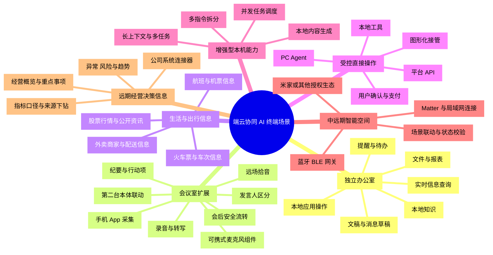
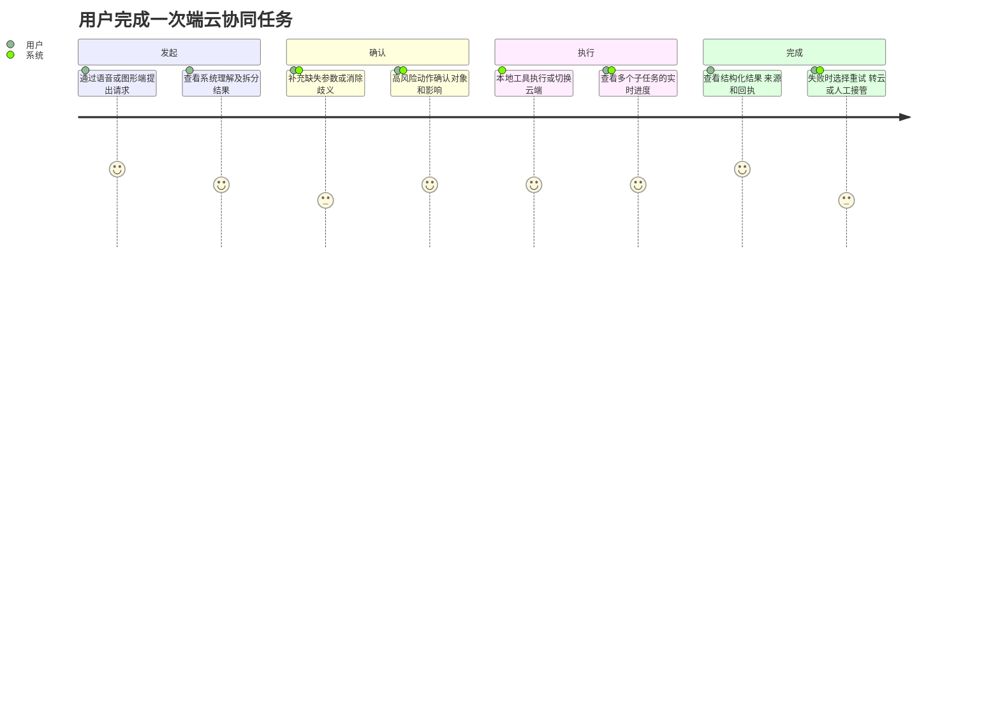
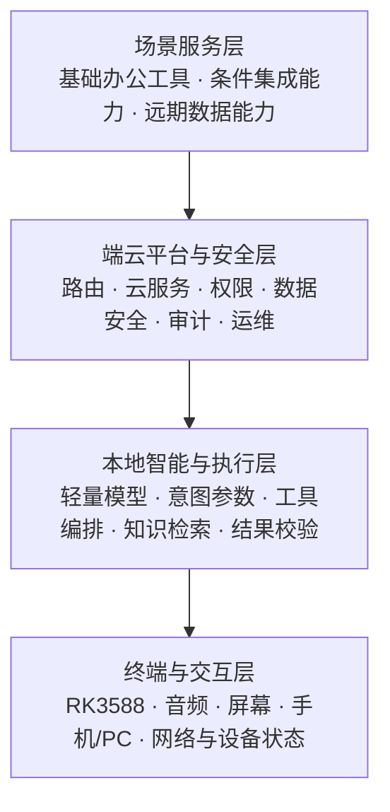
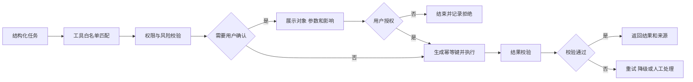

# 端云协同 AI 终端产品功能设计书

> 文档状态：评审稿
>
> 版本：V0.7
>
> 日期：2026-07-26
>
> 适用阶段：需求冻结、MVP 立项、研发拆解与测试设计

## 0. 文档说明

### 0.1 编制目的

本文档用于定义端云协同 AI 终端的产品功能范围、用户交互、业务规则、端云边界、安全控制、异常处理和验收口径。文档以《端云协同AI终端产品设计与选型方案》为上位输入，以《端云协同AI终端四层功能思维导图（修订版）》为能力索引。

本文档解决“产品做什么、用户如何使用、系统如何响应、什么情况算完成”的问题，不替代硬件详细设计、模型评测报告、接口文档、数据库设计或测试用例集。

### 0.2 当前结论

- 首代建议采用 RK3588 标准型，验证“本地工具执行 + 轻量语言交互 + 云端能力兜底”的完整闭环。
- 潜在核心使用者可包括企业管理者（如 CEO、董事长）及办公人员，但产品功能不以具体职位限定。
- 本地轻量模型主要承担理解、参数提取、工具选择、结果润色和状态汇报，不独立承担高风险决策或开放式长链推理。
- MVP 应冻结 3—5 个可独立交付的高频工具，优先验证本地文件、知识检索、会议整理、提醒待办和文稿草拟。
- 外卖、航班、火车票和股票等实时信息查询纳入功能范围，优先通过云端数据服务获取，本地负责交互、权限、缓存和结果展示。
- 直接操作能力按风险分级：本地应用操作可由本地工具或 PC Agent 完成；下单、购票、支付和证券交易采用平台接口或图形化接管，并保留用户最终确认。
- 产品原定主要部署于独立办公室，会议功能同时评估会议室部署模式。
- 会议采集可优先通过手机 App 完成，不要求额外设备；可携式麦克风组件或第二台本体作为更高拾音质量、续航或独立运行需求下的可选方案。各采集端均与办公室主机进行可信绑定和数据联动。
- 增强型增加多指令拆分、并发任务调度和更复杂的本机内容生产能力。
- 中远期可接入米家或其他智能空间生态，并根据硬件能力承担蓝牙/BLE 网关角色；同时保留 Matter、局域网连接器和官方授权云接口等路径。
- 企业经营与决策信息仅作为远期目标，必须结合公司实际业务系统、数据平台和指标定义开发，不作为通用开箱能力或中短期承诺。
- 复杂推理、联网信息、超长上下文或本地校验失败的任务由云端承接。
- 订票、付款、提交、删除、对外发送和设备控制等具有外部影响的动作，必须经过权限校验和用户确认，不允许模型自行决定。

### 0.3 待评审前提

以下事项尚未由业务正式冻结，文中相关设计均作为建议基线：

1. 首代主要使用环境、部署方式和采购场景。
2. 首批接入的 3—5 个工具和业务系统。
3. 数据本地化、内外网隔离及云端使用的合规边界。
4. 设备是否必须配套独立屏幕，以及手机端承担图形入口、会议采集和任务协同的范围。
5. 增强型的启动时间和商业条件。

### 0.4 术语

| 术语 | 定义 |
|---|---|
| 设备端 | RK3588 或后续硬件平台上的终端设备及其本地服务 |
| 图形端 | 设备屏幕、手机端或 PC 端中用于展示状态、确认动作和查看结果的界面 |
| 本地工具 | 在设备端或受控局域网内执行的确定性程序、接口或工作流 |
| 云端能力 | 云端大模型、联网检索、复杂推理、运营管理及模型更新服务 |
| 任务 | 用户一次明确意图及其从创建到结束的完整处理记录 |
| 高风险动作 | 可能产生资金、数据、权限、外部沟通或设备状态变化的操作 |
| 结果校验 | 对工具执行结果进行格式、对象、权限、完整性和业务状态检查 |

## 1. 产品概述

### 1.1 产品定位

产品定位为具备语音和图形交互能力的端云协同 AI 终端。它以自然语言作为任务入口，以确定性工具和受控工作流完成文件、知识、会议、提醒和内容处理任务，通过本地优先、云端兜底的方式平衡响应速度、数据安全、任务能力和运行成本。

首代产品不是通用聊天机器人，也不是单纯的本地大模型硬件。核心价值在于把自然语言请求稳定转换为可理解、可确认、可执行、可验证、可追溯的任务。

### 1.2 产品目标

1. 用户可通过语音或图形界面发起常用任务，并持续看到任务状态。
2. 系统能够识别意图、补充缺失参数、调用白名单工具并校验结果。
3. 查询和摘要结果能够回溯到来源、更新时间和原始记录。
4. 系统能够依据风险、网络、数据和资源条件选择本地或云端处理。
5. 敏感数据默认不出端，高风险动作由用户保留最终决策权。
6. 失败时提供可理解原因和可执行的恢复路径，而不是暴露技术错误。
7. 通过统一账号、任务和通知模型为后续多端连续体验提供基础。

### 1.3 非目标

- 首代不追求在端侧部署尽可能大的模型。
- 首代不支持模型自由访问文件系统、内外网或任意第三方接口。
- 首代不承诺所有网站或第三方应用的无人值守自动化。
- 首代不把开放式闲聊、智能家居和生活服务作为立项成功的核心条件。
- 首代不允许未经用户确认的付款、删除、提交、对外发送或控制操作。
- 首代不以跨系统经营数据分析或自动决策作为交付目标。

### 1.4 产品设计原则

| 原则 | 产品要求 |
|---|---|
| 边界清晰 | 明确区分本地可完成、需要云端、依赖外部系统和必须由用户接管的任务 |
| 来源可查 | 查询和摘要结果应标注来源、更新时间和适用范围 |
| 场景优先 | 先确定高频任务、用户价值、响应要求和数据边界，再选择模型与工具 |
| 工具优先 | 模型负责理解和编排，业务结果由白名单工具和确定性工作流产生 |
| 本地优先 | 敏感数据、简单任务和高频任务尽量在本地处理 |
| 云端兜底 | 联网信息、复杂推理、长上下文和本地失败可切换云端 |
| 状态可见 | 用户始终能够判断系统正在理解、等待、执行、校验还是失败 |
| 决策归用户 | 高风险动作必须显示对象、内容、影响并获得明确授权 |
| 失败可恢复 | 错误信息必须说明原因、影响和下一步选项，并尽量保留上下文 |
| 全程可追溯 | 关键输入、路由、确认、工具调用、结果和异常应形成审计记录 |

## 2. 场景设计（优先）

### 2.1 场景定位与使用角色

产品原定主要部署于独立办公室，作为常驻式语音和图形交互终端；会议能力可扩展到会议室，通过更适合多人、远场拾音和共享设备的部署方式提供服务。手机 App 除承担状态查看、确认、文件打开和人工接管外，也可作为会议录音采集端；PC 端主要承担状态查看、文件处理和人工接管。

产品采用通用角色模型，不针对具体职位设计专属事实或功能。不同部署项目通过权限、工具、数据源和快捷任务配置适配普通用户、授权操作人员、系统管理员及审计人员。

### 2.2 场景全景导图

### 2.3 场景与端云实现矩阵

| 场景 | 主要能力 | 建议执行方式 | 阶段 | 关键依赖或限制 |
|---|---|---|---|---|
| 文件与报表 | 查找、打开、摘要 | 本地索引 + 本地工具/PC Agent | MVP | 文件权限、应用打开回执 |
| 本地知识 | 制度、手册、业务资料查询 | 本地检索，复杂问答可脱敏转云 | MVP | 知识版本、权限、来源引用 |
| 提醒与待办 | 创建、修改、完成、通知 | 本地任务服务 | MVP/P1 | 时区、重复规则、通知渠道 |
| 文稿与消息 | 润色、草拟、预览 | 本地轻量模型；复杂内容可转云 | MVP/P1 | 原文保护、发送前确认 |
| 会议记录 | 录音、转写、纪要 | 本地采集 + 本地/云端转写 | MVP | 录音告知、音频质量、留存策略 |
| 会议室模式 | 远场拾音、多人转写、会后流转 | 本地音频前处理 + 可选云端识别 | 工程化 | 麦克风阵列、声学环境、共享设备隔离 |
| 移动会议采集 | 手机 App、可携麦克风或第二台本体采集、缓存和同步 | 账号/设备可信绑定 + 本地加密缓存 + 断点续传 | P1 验证/工程化 | 录音权限、中断恢复、电量、存储、网络、同步去重和终端丢失控制 |
| 外卖信息 | 商家、菜品、价格、配送时间 | 云端平台/API 查询，本地展示与缓存 | P1 验证 | 定位、账号、平台授权、信息时效 |
| 航班/机票 | 航班、价格、余票和状态 | 云端数据服务或平台 API | P1 验证 | 实时数据源、价格变化、实名信息 |
| 火车票 | 车次、余票、时刻和价格 | 云端数据服务或平台 API | P1 验证 | 实时数据源、实名信息、验证码 |
| 股票信息 | 行情、公告和公开资讯 | 合规云端行情源，本地展示 | P1 验证 | 数据授权、延迟标识、不得冒充投资建议 |
| 本地直接操作 | 打开应用、文件、页面或执行白名单命令 | 本地工具/PC Agent | MVP/工程化 | 白名单、幂等、结果校验 |
| 下单与购票 | 选择方案、填写信息、提交、支付 | 平台 API 或图形化接管 | 工程化/远期 | 强确认、验证码、支付、退改规则 |
| 证券交易 | 打开持牌客户端并引导用户操作 | 本地深链或图形化接管 | 远期 | 持牌接口、强认证、适当性和交易合规；禁止无人值守 |
| 项目/业务查询 | 状态、里程碑、业务记录 | 受控业务连接器 | 条件集成 | 上游接口、数据口径、权限和校验器 |
| 智能空间与网关 | 米家或其他生态设备查询、场景控制、蓝牙/BLE 网关 | 本地网关 + Matter/局域网连接器 + 官方授权云接口 | 中远期 | 无线模块、协议栈、生态授权、认证、兼容清单和状态回执 |
| 企业经营决策信息 | 经营概览、重点事项、异常、风险和趋势 | 公司系统连接器 + 数据平台 + 端云分析 | 远期 | 公司实际系统、指标目录、权限、血缘、质量和责任机制 |

### 2.4 核心任务旅程

### 2.5 中短期场景优先级

| 场景编号 | 场景 | 建议优先级 | 进入条件 |
|---|---|---|---|
| S-01 | 授权文件查找与报表打开 | P0 | 文件索引、权限和打开方式可控 |
| S-02 | 本地知识与制度查询 | P0 | 知识库已建立索引和权限 |
| S-03 | 会议记录与纪要生成 | P0 | 音频采集和转写质量达到基线 |
| S-04 | 提醒、日程与待办 | P1 | 本地任务服务和通知渠道可用 |
| S-05 | 文稿润色与消息草拟 | P1 | 输出保持草稿，发送流程具备二次确认 |
| S-06 | 外卖、航班、火车票和股票信息查询 | P1 验证 | 合法稳定的实时数据源和云端连接 |
| S-07 | 本地应用和白名单工具直接操作 | P1 | 工具权限、幂等和结果校验完整 |

### 2.6 实施边界

- 中短期聚焦独立办公室场景和不依赖完整经营数据平台即可交付的能力；会议室作为工程化扩展场景。
- 实时信息查询与直接操作分开验收。查询成功不代表具备下单、购票、支付或交易能力。
- 项目状态等业务查询只有在上游系统提供稳定接口、权限和数据口径时才进入项目范围。
- 经营数据分析依赖跨系统数据治理，仅作为远期方向。
- 智能空间接入不承诺无边界控制米家或其他生态；每个项目需按官方授权、兼容清单、网络条件和设备状态回执确定可用范围。

## 3. 产品形态与版本边界

### 3.1 标准型

标准型以 RK3588 为建议基线，主要面向独立办公室常驻部署，承担轻量模型推理、本地工具执行、任务状态管理、权限控制和端云路由。图形交互可以由设备屏幕或手机端提供，PC 端作为后续工程化能力接入。会议采集可优先由手机 App 完成，不新增专用硬件；需要更高拾音质量、续航或独立运行时，再选配可携式麦克风组件或第二台标准型本体。

### 3.2 增强型

增强型采用更高算力与更大内存平台，与标准型共享账号、任务、工具、安全和交互逻辑，增加复杂内容生成、更长上下文、多指令拆分和多任务并发能力。它可以通过异步队列、线程池、多进程或推理服务并发等方式实现，但产品设计不绑定单一处理器架构或技术方案。

增强型应支持前台交互、后台检索、文件处理和内容生成并行运行，并对模型、CPU/GPU/NPU、内存和工具连接器设置资源配额。增强型是否立项应以标准型 MVP 的真实使用反馈和新增能力价值为前提。

### 3.3 能力阶段

| 阶段 | 能力范围 |
|---|---|
| MVP | 轻量模型、3—5 个工具、任务状态页、关键操作确认、结果校验、云端兜底 |
| 工程化 | 会议室模式、实时信息服务、受控直接操作、统一账号、审计、多端同步、监控和远程升级 |
| 增强型 | 多指令拆分、并发调度、本地复杂文本、PPT/图表/网页生成和长上下文 |
| 远期 | 智能空间与网关接入、企业经营决策信息、高风险交易闭环和跨生态协同等高依赖能力 |

## 4. 产品功能结构

场景全景导图已集成在第 2.2 节；本节说明场景与四层能力的依赖关系。《端云协同AI终端四层功能思维导图（修订版）》继续作为带阶段、难度和可行性评级的详细能力索引。

## 5. 通用交互与任务机制

### 5.1 统一任务入口（FR-INT-001）

**目标**：允许用户通过语音、触屏或手机端以一致方式创建任务。

**前置条件**：用户已登录；设备和入口已绑定；入口具备基础网络或本地服务连接。

**主流程**：

1. 用户输入语音或文字请求。
2. 系统生成任务并显示原始请求。
3. 系统识别意图、对象、时间、范围和期望动作。
4. 系统展示理解结果；参数缺失或对象歧义时进入补充确认。
5. 参数完整后进入风险、权限和路由判定。

**产品规则**：

- 语音识别文本应允许用户查看和修正。
- 同一输入不得因用户重复点击或网络重发创建多个有效任务。
- 用户可在执行前取消任务；执行后是否可撤销由具体工具定义。
- 系统不得把无法识别的请求自动映射到高风险动作。

**验收要求**：

- 语音、文字入口生成统一任务编号和统一状态记录。
- 参数不足时不执行工具，并明确指出缺失内容。
- 用户取消后，未开始的工具调用不得继续执行。
- 一次输入包含多个指令时，系统应展示拆分结果、依赖关系和预计执行顺序。

### 5.2 任务状态模型（FR-TSK-001）

| 状态 | 用户可见文案示例 | 进入条件 | 可用操作 |
|---|---|---|---|
| 已创建 | 已收到请求 | 输入已形成任务 | 取消 |
| 正在理解 | 正在识别任务内容 | 模型处理输入 | 取消 |
| 等待补充 | 还需要确认项目名称 | 参数缺失或对象歧义 | 补充、取消 |
| 等待授权 | 请确认执行对象和影响 | 权限或风险要求确认 | 确认、拒绝 |
| 正在执行 | 正在查询项目系统 | 工具或云端已开始处理 | 查看详情、取消（如支持） |
| 正在校验 | 正在确认执行结果 | 工具已返回结果 | 查看详情 |
| 已完成 | 任务已完成 | 结果校验通过 | 查看、追问、导出 |
| 部分完成 | 已完成 2 项，1 项需要处理 | 多步骤任务部分成功 | 重试失败项、人工处理 |
| 已失败 | 未能打开报表 | 无法继续或结果校验失败 | 重试、转云、人工处理 |
| 已取消 | 任务已取消 | 用户或系统取消 | 重新发起 |

状态变化必须按顺序记录时间、执行端和原因。任务进入结束状态后，不得被后台进程静默改为成功。

### 5.3 状态与反馈（FR-FBK-001）

系统应在图形端持续显示：任务名称、当前状态、执行端、本次涉及的数据或工具、关键确认点、已用时间和可用操作。

异常提示统一采用“发生了什么—造成什么影响—用户可以做什么”的结构。例如：

> 项目系统当前不可用，本次未获取到最新进度。你可以稍后重试、切换到缓存结果，或打开项目系统手动查看。

系统不得直接向普通用户展示堆栈、内部地址、令牌、数据库错误或未经解释的错误码。

### 5.4 连续对话与追问（FR-CTX-001）

- 用户在同一任务内追问时，系统可继承已确认的对象、时间和范围。
- 涉及新的数据范围、执行对象或风险等级时，必须重新确认。
- 上下文不得跨账号继承；共享设备切换用户后必须清除个人上下文。
- 云端接收的上下文应满足最小必要原则，并记录实际发送内容的摘要。

## 6. 本地智能与工具执行

### 6.1 意图识别与参数提取（FR-AI-001）

系统需要输出结构化任务描述，至少包括：意图类型、目标对象、动作、时间范围、数据范围、输出形式、风险提示和缺失参数。

**规则**：

- 模型输出必须经过结构校验，不符合约定格式时不得直接调用工具。
- 对象名称只能从用户输入、已授权索引或工具返回结果中选择，不得猜测文件路径、项目编号或联系人。
- 同名对象存在多个候选时必须展示候选项并让用户选择。
- 模型置信度仅作为路由或补充确认依据，不能替代权限校验和业务校验。

### 6.2 工具注册与白名单（FR-TOL-001）

每个工具必须登记以下元数据：

| 字段 | 说明 |
|---|---|
| 工具编号与版本 | 全局唯一，可追溯到具体实现版本 |
| 功能描述 | 明确工具能做什么和不能做什么 |
| 输入参数 | 类型、是否必填、可选范围和敏感级别 |
| 输出结构 | 成功、失败和部分成功的结构定义 |
| 所需权限 | 用户、角色、数据域和系统权限 |
| 风险等级 | 工具默认风险及动态升级条件 |
| 幂等规则 | 重复请求如何识别和处理 |
| 超时与重试 | 最大等待、允许重试次数和退避规则 |
| 结果校验器 | 判断成功、对象正确和结果完整的方式 |
| 补偿或撤销 | 执行失败或误操作后的处理方式 |

未注册、版本失效、权限不完整或缺少校验器的工具不得进入生产白名单。

### 6.3 工具执行（FR-TOL-002）

**执行规则**：

- 工具执行前再次校验用户会话、工具版本和参数有效期。
- 对外部系统产生写操作时必须生成幂等键，防止重复提交。
- 多步骤任务应按步骤记录状态，单步失败不得伪装为整体成功。
- 工具返回的原始数据不得未经处理直接作为模型指令继续执行。
- 结果校验失败时，应保留原始回执并禁止模型自行宣告成功。

### 6.4 结果呈现（FR-RES-001）

结果页至少包含：任务结论、关键数据、来源、更新时间、执行端、完成状态和后续操作。生成型内容必须标识为草稿；推断性结论应区分事实、推断和待确认项。

### 6.5 多指令拆分与并发调度（FR-CON-001）

增强型应支持从一次输入中识别多个子任务。例如“打开项目报表，同时查明早航班，再提醒我下午三点开会”应拆分为文件、实时查询和提醒三个任务。

**调度规则**：

- 系统先建立子任务依赖图；相互独立的任务可以并发，有前置结果依赖的任务按顺序执行。
- 前台语音交互、确认和取消优先级高于后台检索、下载和内容生成。
- 每个子任务独立记录状态、执行端、资源占用和结果；单个失败不应中断无依赖的其他任务。
- 涉及多个高风险动作时逐项确认，不允许一次确认覆盖后续发生变化的任务。
- 系统根据 CPU/GPU/NPU、内存、网络和工具连接器容量设置并发上限，资源不足时进入队列而不是无界创建执行单元。
- 技术实现可采用异步队列、线程池、多进程或独立推理服务；多线程是可选方案，不能以牺牲隔离、取消和结果一致性为代价。

**验收重点**：独立任务可并行推进；依赖任务顺序正确；取消单个任务不影响其他任务；高负载下任务状态和确认操作仍可响应。

## 7. 端云路由设计

### 7.1 路由输入（FR-RTE-001）

路由判定至少考虑以下因素：

- 任务是否已有本地固化工具。
- 参数是否完整，对象是否明确。
- 操作风险和数据敏感等级。
- 当前网络、CPU/NPU、内存和存储状态。
- 本地模型输出是否通过结构及业务校验。
- 是否需要联网信息、复杂推理或超长上下文。
- 云端服务可用性、成本配额和合规策略。

### 7.2 路由规则

| 条件 | 路由结果 | 用户体验 |
|---|---|---|
| 已有本地工具、参数完整、风险低、资源满足 | 本地直接执行 | 显示“本地处理” |
| 参数缺失、对象歧义或风险需要确认 | 本地补充确认 | 展示待确认内容 |
| 需要联网信息、复杂推理或本地校验不通过 | 切换云端 | 显示切换原因和数据范围 |
| 涉及验证码、支付、关键授权或不可预测网页 | 图形化接管 | 引导用户完成关键步骤 |
| 网络不可用且本地无法完成 | 失败降级 | 保留上下文并提供重试或人工处理 |
| 敏感数据不允许出端且本地无法完成 | 拒绝转云 | 说明限制，不上传数据 |

### 7.3 云端切换（FR-RTE-002）

- 切换前对上下文执行最小化和脱敏。
- 切换时展示“为什么切换、发送什么、预计影响”；低风险且管理员已预授权的场景可简化提示。
- 端云使用统一任务编号和工具协议，云端返回后继续进入同一结果校验流程。
- 云端失败后不得循环切换；应根据重试预算进入本地降级或人工处理。
- “零延迟切换”仅作为体验方向，不作为绝对承诺。

## 8. 场景功能详细设计

### 8.1 授权文件查找与报表打开（FR-OFF-001）

**用户故事**：作为用户，我希望通过自然语言找到有权限访问的文件或报表，并在正确应用中打开。

**输入示例**：“打开华东项目上周的销售报表。”

**前置条件**：文件或报表已建立授权索引；用户具备读取权限；设备或 PC 端已注册对应打开方式。

**主流程**：

1. 提取项目、文档类型和时间范围。
2. 查询授权索引，不直接遍历未授权目录。
3. 唯一匹配时展示文件名、来源、更新时间和路径摘要。
4. 多个候选时按相关度和更新时间展示，要求用户选择。
5. 调用本地或 PC 工具打开文件。
6. 校验目标应用是否成功接收并显示文件。

**异常与边界**：无权限时只说明无法访问，不泄露文件内容；文件不存在时允许调整关键词；版本过旧时提示最新版本；打开失败时提供所在目录或手动打开选项。

**验收重点**：不得返回越权文件；同名文件必须确认；系统宣告“已打开”前必须收到工具成功回执。

### 8.2 本地知识与制度查询（FR-OFF-002）

**用户故事**：作为用户，我希望查询有权限访问的制度、手册和业务资料，并获得带来源的简洁回答。

**输入示例**：“差旅报销需要哪些材料？”

**主流程**：识别问题与范围 → 校验用户和知识域权限 → 检索本地知识库 → 对候选片段排序 → 生成回答 → 展示来源、版本和更新时间。

**产品规则**：

- 回答只能使用用户有权限访问的知识片段。
- 每个关键结论必须提供来源文档和可定位的引用片段。
- 多个制度版本冲突时优先显示当前有效版本，并提示历史版本差异。
- 检索结果不足时应说明未找到可靠依据，不得以通用知识冒充组织制度。
- 原文包含敏感字段时，结果展示和云端切换继续受数据分级规则约束。

**验收重点**：不得越权引用；回答可回溯到原文；失效版本有明确标记；无可靠来源时不生成确定性结论。

### 8.3 会议记录与纪要生成（FR-OFF-003）

**用户故事**：作为会议参与者，我希望设备在获得同意后记录会议并生成可编辑纪要，从而减少会后整理工作。

**前置条件**：用户具备录音权限；会议参与者已按组织规则获得告知；存储位置和保留期限已配置。

**主流程**：开始前确认录音 → 展示录制状态 → 实时或会后转写 → 区分原文与摘要 → 生成议题、结论、行动项和待确认项 → 用户编辑确认 → 保存或导出。

**产品规则**：

- 录音状态必须持续可见，并提供显著的暂停和停止操作。
- 纪要不得覆盖原始转写；自动生成内容默认处于草稿状态。
- 行动项至少包含事项、建议负责人、建议截止时间和来源片段。
- 系统不得把讨论意见自动标记为正式结论；重要结论必须由用户复核。
- 无法可靠识别发言人时使用“发言人 1”等中性标识，不猜测姓名。
- 删除录音与删除纪要分开控制，并遵循数据留存策略。

**验收重点**：未确认不得开始录音；停止后采集立即结束；纪要可回溯到对应转写片段；导出前显示敏感信息提示。

### 8.4 会议室部署模式（FR-MTG-001）

会议室模式是独立办公室场景的工程化扩展，面向多人、远场、共享设备和长时间会议，不直接复用单人近场录音配置。

**部署能力**：

- 支持麦克风阵列、回声消除、降噪、增益控制和远场语音活动检测。
- 支持按会议或预约创建独立会话，会议结束后自动关闭采集并锁定原始记录。
- 录音状态通过屏幕、指示灯或明确提示持续可见；静默、暂停和停止操作在会议过程中始终可用。
- 支持发言人区分；无法可靠识别身份时仅使用匿名发言人编号。
- 共享设备不得默认继承上一场会议的账号、参与人、上下文或资料权限。
- 会后纪要、转写和行动项先进入授权人员复核，再按权限流转或导出。

**部署评估**：会议室面积、座位布局、混响、噪声、麦克风数量、网络质量、供电、安装位置和本地存储容量应纳入现场勘测。转写可采用本地或云端方案，但原始音频是否上云必须受组织策略控制。

**验收重点**：指定会议室覆盖范围内语音可用；录音状态对参与者清晰可见；会议之间数据隔离；断网时不丢失已采集音频；会后材料按权限流转。

### 8.5 移动会议采集与跨端联动（FR-MTG-002）

会议采集扩展提供三种候选形态。手机 App 是无需新增硬件的优先验证路径，专用设备按现场要求选配：

| 形态 | 主要职责 | 优点 | 主要约束 |
|---|---|---|---|
| 手机 App | 调用手机麦克风采集、显示录音状态、本地加密缓存、向主机同步音频和会议元数据 | 无需新增设备，部署快，可利用现有账号、网络和屏幕完成授权与状态反馈 | 受录音权限、来电/音频焦点、后台运行、电量、存储、机型和系统版本影响；远场拾音质量需实测 |
| 可携式麦克风组件 | 远场/近场采集、录音提示、本地加密缓存、向主机传输音频 | 便携、成本和功耗较低，可临时带入会议室 | 依赖主机完成主要转写和纪要；需关注续航、存储与丢失风险 |
| 第二台本体 | 独立采集、现场转写、状态显示、工具与任务处理、会后同步 | 可独立运行，交互和处理能力完整 | 成本较高，需要设备身份、版本、账号和数据冲突管理 |

**联动规则**：

- 手机 App 通过账号登录、设备绑定和单次会议授权接入；办公室主机、可携麦克风和第二台本体可通过一次性验证码、二维码、NFC 或管理员授权建立可信关系。所有形态均禁止仅因发现终端而自动信任。
- 每次会议创建唯一会议会话编号；所有音频片段、转写、纪要和行动项均携带设备编号、会话编号和时间范围。
- 手机 App 必须在开始前取得录音权限并持续显示录音状态；权限被撤销、来电抢占音频、应用被系统终止或存储不足时，应立即提示并保留已完成片段，允许恢复或结束会话。
- 手机 App 和可携麦克风默认只采集和加密缓存，不保存长期用户上下文，也不持有业务系统凭据；App 密钥和绑定凭据使用操作系统安全存储。
- 第二台本体可离线完成采集和部分处理；恢复连接后按同步清单上传缺失数据，不覆盖主机上已确认的纪要。
- 同一会议由一个终端担任主协调节点。多个采集端同时工作时按会话、时间片和内容哈希去重，避免生成重复音频、转写或行动项。
- 数据传输采用加密通道、完整性校验、分片断点续传和失败重试；主机确认接收完整后，移动设备按留存策略删除或保留本地副本。
- 手机 App 默认可配置仅在 Wi-Fi、充电或用户确认后上传大文件；网络切换和后台恢复不得产生重复片段。
- 手机或移动设备丢失、退出账号或停用时，管理员可撤销信任、阻止后续同步，并在终端在线时触发受控数据清理。
- 会议数据不会因设备联动自动上云；是否使用云端转写继续由组织策略和当前会议数据级别决定。

**验收重点**：未绑定终端不能读取会议数据；手机 App 在权限拒绝、来电中断、后台切换、低电量、存储不足和网络切换下状态明确且不丢失已完成片段；断网采集可恢复同步；重复片段不产生重复纪要；同步中断可续传；丢失终端撤销后无法重新接入；主机与采集端的最终会话状态一致。

### 8.6 提醒、日程与待办（FR-OFF-004）

**用户故事**：作为用户，我希望通过自然语言创建、查看、修改和完成个人提醒或待办。

**输入示例**：“明天下午三点提醒我准备项目会议材料。”

**主流程**：识别事项与时间 → 校验时区、日期和重复规则 → 展示确认 → 创建任务 → 到期通知 → 用户完成、延后或取消。

**产品规则**：

- 日期或时间存在歧义时必须确认，不得按模型猜测创建。
- 重复提醒需要展示频率、开始时间和结束条件。
- 修改和删除操作必须明确目标任务；同名任务存在多个时要求用户选择。
- 通知内容涉及敏感信息时默认只显示摘要。
- 多端同步进入工程化阶段，MVP 至少保证设备端和一个图形端状态一致。

**验收重点**：提醒时间正确；重复任务规则可查；取消后不再通知；完成状态持久保存。

### 8.7 文稿润色与消息草拟（FR-OFF-005）

**用户故事**：作为用户，我希望基于原文和指定语气生成可编辑草稿，同时保留最终修改和发送权。

**主流程**：输入原文或选择文档 → 选择用途、对象和语气 → 生成草稿 → 显示改动或摘要 → 用户编辑 → 复制、保存或进入授权发送流程。

**产品规则**：

- 不得改变原文中的关键事实、数字、日期和责任主体；如需调整必须提示。
- 没有来源支持时不得补写具体事实。
- 草稿必须标识“未发送”。
- 对外发送是独立高风险动作，至少确认收件人、正文、附件和发送渠道。
- 用户可选择正式、简洁、中性等语气，但不得通过语气设置绕过内容安全规则。

**验收重点**：生成失败不影响原文；发送前可完整预览；未经明确确认不得调用发送工具。

### 8.8 实时外部信息查询（FR-INF-001）

系统应提供外卖、航班、火车票、股票等公开或用户授权信息的查询入口。实时信息原则上由云端数据服务或平台 API 提供，本地端负责意图解析、查询条件确认、隐私最小化、缓存和统一展示。

| 信息类型 | 最低查询字段 | 结果要求 | 特别限制 |
|---|---|---|---|
| 外卖 | 位置、品类、时间 | 商家、菜品、价格、配送费、预计送达、数据时间 | 位置和地址属于敏感信息；价格以平台结算页为准 |
| 航班/机票 | 出发地、目的地、日期、人数 | 航班号、起降时间、价格范围、余票或状态、数据时间 | 价格和余票可能快速变化；不得把缓存结果表述为最终可售 |
| 火车票 | 出发地、目的地、日期、席别 | 车次、时刻、历时、余票、价格、数据时间 | 余票时效高；实名信息不进入普通日志 |
| 股票 | 市场、代码或名称、时间范围 | 行情、涨跌、公告或公开资讯、来源和延迟标识 | 使用合法授权数据源；信息不构成投资建议 |

**产品规则**：

- 结果必须显示数据来源、更新时间或行情延迟；过期缓存要显著标识。
- 多个平台的价格口径不一致时分别展示，不生成虚假的统一价格。
- 查询条件含位置、行程、乘车人或自选股时，按个人数据规则存储和使用。
- 信息查询不得自动进入下单、购票、支付或交易步骤。

**验收重点**：查询条件可修正；来源和时效可见；云端不可用时明确说明缓存状态；股票结果不生成确定性买卖指令。

### 8.9 受控直接操作（FR-ACT-001）

系统可通过本地工具、PC Agent、平台 API、应用深链或图形化接管执行操作。实现顺序建议为：确定性本地工具 → 官方或已授权 API → 打开目标应用并预填信息 → 用户图形化接管。不可预测网页和第三方客户端不得由模型无限制自由操作。

**操作分级**：

- 低风险：打开文件、应用、网页或查询页面，可在权限和对象明确后直接执行。
- 中风险：创建草稿、填充表单、选择外卖或票务方案，系统完成准备后停在确认节点。
- 高风险：提交订单、实名购票、支付、退款、证券交易或修改关键业务数据，必须强身份验证、完整预览和逐项确认。

**股票交易边界**：行情和公开资讯查询可以作为信息服务；实际交易只能通过持牌机构提供的客户端或授权接口进行。产品默认打开目标客户端并引导用户接管，不保存交易密码，不绕过双重认证、风险揭示或适当性要求，不支持无人值守交易。

**产品规则**：

- 直接操作必须记录对象、参数、执行通道、确认内容和最终回执。
- 页面、价格、库存、席位或订单内容在确认后发生变化时，原确认自动失效。
- 验证码、支付密码、人脸识别和硬件令牌由用户在受信界面完成，模型不得代填或截取。
- 第三方平台失败或状态不明时先查询实际订单/交易状态，再决定是否重试，防止重复提交。

**验收重点**：低风险操作有成功回执；高风险操作未经有效确认不得提交；敏感凭据不进入模型上下文；状态不明时不自动重试写操作。

### 8.10 条件集成与远期目标

- 项目状态、里程碑和业务系统查询可作为条件集成能力。只有在上游接口、权限、数据质量和结果校验规则明确后，才纳入具体项目范围。

#### 8.10.1 智能空间与网关接入（FR-IOT-001）

产品中远期可作为办公室与会议空间的智能入口，接入米家或其他生态中的照明、空调、窗帘、传感器等设备，并评估由本机承担蓝牙/BLE 网关的可行性。该能力不是首代 MVP 条件，需按具体项目选择以下一种或多种实现路径：

1. 在硬件无线模块、天线、驱动和协议栈满足要求时，提供蓝牙/BLE 设备发现、可信配对、状态采集和受控指令转发。
2. 对支持 Matter 的设备通过合规控制器、边界路由器或适配模块接入；Thread 能力需另行确认硬件与认证条件。
3. 对局域网设备使用厂商 SDK、标准协议或白名单连接器，限制可发现网段、设备类型和操作范围。
4. 对米家或其他云生态优先使用官方或明确授权的开放平台接口，不依赖绕过认证、抓取私有协议或不可维护的模拟操作。

**产品规则**：

- 建立项目级兼容清单，记录设备型号、固件、接入方式、可读状态、可执行动作和已验证版本。
- 查询类请求展示实时状态、来源和更新时间；控制类请求必须验证设备当前状态及执行回执，禁止仅凭模型输出宣告成功。
- 门锁、安防、供电、温控上限等具有安全或财产影响的操作按高风险动作处理，执行前展示对象、动作和影响并要求确认。
- 生态授权失效、网关离线、设备不可达或状态不明时，不盲目重试写操作；应提示人工检查或切换原生应用。

**验收重点**：通过项目兼容清单内的设备完成发现/授权、状态查询、受控操作、失败反馈和审计；未列入清单的设备不得宣称支持。

#### 8.10.2 企业经营与决策信息（FR-BIZ-001）

经营概览、重点事项提炼、异常识别、风险提示和趋势解读列为远期目标。该能力必须结合公司实际组织、业务流程、源系统和管理口径定制开发，不作为终端开箱即用能力，也不进入中短期产品验收。

**建设前提**：

1. 形成 ERP、CRM、财务、项目、供应链或其他实际源系统的授权连接器，并明确刷新频率、可用性和责任人。
2. 建立数据平台或可信数据服务，形成指标目录、业务定义、统计周期、组织范围、数据血缘和版本管理。
3. 对权限、行列级数据范围、数据质量、缺失与延迟、异常阈值和人工复核责任作出明确约定。
4. 输出与公司真实管理流程衔接，包括经营概览、重要事项、异常与风险线索、趋势变化，以及来源下钻入口。

**产品规则**：

- 每项数字、结论和风险线索必须显示指标口径、统计范围、数据时间、来源系统和可下钻记录。
- 数据缺失、延迟、口径冲突或质量检查失败时必须显著提示，不得用模型推断补齐为事实。
- 产品提供事实归集、异常提示和分析辅助，不替代公司治理程序，不进行无人监督的经营决策或关键业务写回。
- 不同公司的系统、指标和权限差异视为项目实施内容，需单独完成调研、接口、数据和验收设计。

**验收重点**：仅在选定公司完成数据前提建设后，使用已冻结指标和真实来源验证概览、异常、趋势、权限隔离、数据质量提示和来源下钻。

## 9. 多端功能设计

### 9.1 账号与设备绑定（FR-MTD-001）

- 一个账号可绑定多个设备端和图形端，管理员可查看和解除绑定。
- 新设备绑定需要已有可信端确认或组织管理员授权。
- 手机 App 以登录图形端和移动采集端双重身份绑定；启用会议采集需单独授予录音权限和组织侧会议权限，退出账号后清除未同步数据的访问密钥。
- 可携麦克风以采集附件身份绑定，不默认获得账号、知识库或业务工具权限。
- 第二台本体以独立可信设备身份绑定，可按部署策略获得会议、用户或工具权限。
- 共享设备必须支持用户切换，切换后隐藏上一用户的任务、通知和上下文。

### 9.2 任务同步（FR-MTD-002）

- 多端展示同一任务编号、状态和结果摘要。
- 确认动作只能由具备权限的登录用户执行。
- 两个端同时操作时，以服务端任务版本控制冲突；重复确认不得触发重复执行。
- 敏感结果可仅显示“任务已完成”，查看详情时再次验证身份。
- 音频等大文件同步应支持分片、完整性校验、断点续传和去重；同步状态应显示在主机和手机 App 或其他采集端上。

该能力建议进入工程化阶段；MVP 至少保证设备端与一个图形端之间的状态一致。

## 10. 权限、数据与执行安全

### 10.1 权限模型（FR-SEC-001）

权限判断由用户身份、组织角色、数据范围、工具权限、设备可信状态和当前会话共同决定。模型不得授予、扩大或推断用户权限。

权限校验至少发生在以下节点：查询候选对象前、展示敏感内容前、调用工具前、执行写操作前和跨端查看详情前。

### 10.2 数据分级

| 等级 | 示例 | 默认处理规则 |
|---|---|---|
| D0 公开 | 公开天气、公开资讯 | 可按策略使用云端 |
| D1 内部 | 普通项目状态、内部制度 | 仅向有权限账号展示；上云需组织策略允许 |
| D2 敏感 | 合同、财务、人员、客户信息 | 默认本地；上云需脱敏和明确策略 |
| D3 受限 | 密钥、凭据、法定限制数据 | 禁止进入模型上下文或外发，使用专用受控工具 |

系统应按字段而不是只按整份文档执行分级。无法识别敏感等级时按更严格等级处理。

### 10.3 操作风险分级

| 等级 | 操作示例 | 产品控制 |
|---|---|---|
| R0 查询 | 查看天气、航班、车次或股票公开行情 | 通过数据和权限规则后可直接执行，显示来源与时效 |
| R1 内部生成 | 生成草稿、创建个人提醒 | 显示结果，可按配置简化确认 |
| R2 外部影响 | 发送消息、预填订单、修改业务记录、控制设备 | 必须展示对象、内容和影响并二次确认 |
| R3 重大影响 | 提交订单、支付、实名购票、证券交易、删除或关键授权 | 图形化接管；强身份验证；记录完整回执；不做无人值守 |

风险等级可以因金额、对象数量、数据级别、执行时间和异常状态动态升级，但不得由模型动态降低。

### 10.4 确认设计（FR-SEC-002）

有效确认必须满足：用户身份有效、页面展示完整、确认对象明确、内容未在确认后变化、确认在有效时间内完成。内容或参数变化后必须重新确认。

确认页至少展示：动作名称、执行对象、关键参数、数据范围、可能影响、是否可撤销和执行端。按钮使用明确动作名称，例如“确认发送”，不得只写“确定”。

### 10.5 审计（FR-AUD-001）

审计记录至少包括：任务编号、用户与设备、输入摘要、结构化意图、路由结果、实际出端数据摘要、确认记录、工具版本、执行参数摘要、结果状态、异常和时间戳。

普通用户可查看自己的任务记录；管理员和审计人员按职责查看组织记录。审计记录的保留期限、脱敏展示和导出权限由组织策略配置。

## 11. 页面与信息设计

### 11.1 首页

首页直接提供语音/文字任务输入，不制作营销式首页。主要区域包括最近任务、待确认任务、提醒与待办、管理员配置的快捷工具，以及网络、端云和设备状态。实时信息服务可使用外卖、航班、火车票和股票等快捷入口，但入口只代表查询能力；直接操作必须进入独立确认流程。

### 11.2 任务详情页

任务详情页按照“请求—理解—确认—执行—结果”的时间线展示，并提供当前可用操作。普通用户默认看到产品语言；技术详情仅向管理员或支持人员开放。

### 11.3 确认页

确认页只服务于一个明确动作，不把多个高风险动作合并成一次确认。重要字段应突出显示，取消入口始终可见。

### 11.4 结果页

结果页优先展示结论和下一步，再展示来源、执行详情和审计信息。生成内容提供编辑、复制和导出；查询结果提供刷新和打开来源；部分成功时逐项标记。

### 11.5 管理端

工程化阶段提供以下配置：用户与角色、设备、工具白名单、数据分级、云端策略、确认策略、审计检索、模型版本、成本配额、告警和远程升级。

## 12. 核心数据对象

| 对象 | 关键字段 |
|---|---|
| 用户 | 用户编号、组织、角色、状态、认证方式、偏好 |
| 设备 | 设备编号、型号、设备角色、系统版本、可信状态、绑定关系、电量、存储和健康状态 |
| 设备配对 | 主设备、从设备、信任凭据、授权范围、创建时间、撤销状态和最近同步时间 |
| 会议会话 | 会话编号、主协调设备、采集设备、开始/结束时间、音频清单、同步和复核状态 |
| 任务 | 任务编号、发起端、原始输入、结构化意图、风险、状态、创建与结束时间 |
| 工具 | 工具编号、版本、参数结构、权限、风险、超时、幂等和校验规则 |
| 执行记录 | 任务编号、执行端、工具版本、参数摘要、回执、耗时和错误 |
| 确认记录 | 确认人、确认端、动作、对象、内容版本、时间和结果 |
| 来源 | 来源系统、记录编号、更新时间、权限范围和引用片段 |
| 审计记录 | 关键事件、操作者、时间、前后状态和追踪编号 |

## 13. 异常与恢复设计

| 异常类型 | 系统处理 | 用户选项 |
|---|---|---|
| 网络不可用 | 判断能否本地继续；保留任务上下文 | 本地处理、稍后重试、取消 |
| 云端不可用 | 按重试预算重试；避免循环切换 | 使用本地受限结果、稍后重试 |
| 上游系统不可用 | 停止相关步骤；保留已完成结果 | 重试失败项、打开原系统 |
| 实时数据过期 | 标记缓存时间，不把缓存表述为实时结果 | 刷新、切换来源、稍后重试 |
| 第三方页面要求验证码或强认证 | 停止自动流程并转图形化接管 | 用户完成验证、取消 |
| 订单或交易状态不明 | 查询第三方实际状态，禁止直接重复提交 | 查看平台记录、人工处理 |
| 权限不足 | 不执行、不泄露受限数据 | 申请权限、切换账号、取消 |
| 参数缺失或歧义 | 进入补充确认 | 选择候选、补充信息、取消 |
| 工具超时 | 查询执行状态，避免直接重复写入 | 等待、查询状态、人工处理 |
| 结果校验失败 | 标记未完成并保留原始回执 | 重试、转云、人工复核 |
| 设备资源不足 | 释放非关键任务或转云 | 转云、稍后执行、取消 |
| 并发任务达到上限 | 保留前台交互，将后台任务排队并显示位置 | 调整优先级、取消排队任务 |
| 内容安全风险 | 中止或限制输出，说明可接受范围 | 修改请求、取消 |

## 14. 非功能要求

### 14.1 性能与体验

- 语音或文字提交后应立即显示已接收状态，避免无反馈等待。
- 首字延迟、总耗时和端云切换耗时应按场景分别统计，不使用单一平均值掩盖长尾问题。
- 长任务必须提供阶段进度；预计耗时明显变化时应更新说明。
- 设备资源不足时优先保证确认、取消、状态展示和审计写入。

### 14.2 稳定性

- 任务状态、确认和工具执行必须支持异常恢复，不因应用重启丢失关键状态。
- 写操作采用幂等控制；重试前查询上次执行结果。
- 升级失败可回滚到上一可用版本，关键配置具备备份和恢复机制。

### 14.3 安全与隐私

- 敏感数据默认不出端；凭据不得写入模型上下文、普通日志或用户提示。
- 传输和存储采用符合组织要求的加密方式。
- 录音、转写、任务历史和审计记录分别配置保留期限。
- 所有后台管理操作纳入审计。

### 14.4 可维护性

- 模型、提示策略、工具和业务规则独立版本化。
- 支持灰度发布、回滚、兼容性检查和回归测试。
- 错误码供内部定位，用户界面使用统一、可恢复的产品文案。

### 14.5 并发与资源管理

- 标准型至少支持前台交互与一个后台工具任务互不阻塞；实际并发数由 RK3588 实测确定。
- 增强型应支持多个独立子任务并发，并区分交互、工具、下载、转写和内容生成资源池。
- 调度器应提供优先级、并发上限、超时、取消、隔离和资源回收机制。
- 多线程、多进程和异步任务均需通过竞态、重复执行、死锁、资源泄漏和异常隔离测试。

## 15. 指标与埋点

### 15.1 核心指标

| 指标 | 定义 | 建议 MVP 基线（待评审） |
|---|---|---|
| 核心任务完成率 | 校验通过的完成任务数 / 有效任务数 | 不低于 90% |
| 工具调用准确率 | 正确工具且参数正确的调用数 / 工具调用数 | 不低于 95% |
| 关键操作确认覆盖率 | 有有效确认记录的 R2/R3 操作数 / R2/R3 操作数 | 100% |
| 未授权敏感数据外发率 | 未经策略允许而出端的敏感数据事件数 | 0 |
| 异常可恢复率 | 用户通过产品提供路径恢复的异常数 / 可恢复异常数 | 不低于 85% |
| 结果来源覆盖率 | 带有效来源的查询与摘要结果数 / 应带来源结果数 | 100% |
| 实时信息时效标识覆盖率 | 显示来源和数据时间的实时查询结果数 / 实时查询结果数 | 100% |
| 会议录音告知覆盖率 | 具备持续可见录音提示的会议记录数 / 会议记录数 | 100% |
| 并发任务隔离成功率 | 单任务失败或取消未影响无依赖任务的次数 / 并发测试次数 | 正式并发测试集冻结后确定 |
| 单任务云端成本 | 云端模型、检索和服务的平均及分位成本 | 按客户成本上限冻结 |
| 连续运行稳定性 | 设备在测试周期内无关键服务中断的时长 | 在工程样机阶段确定基线 |

以上阈值是产品评审建议值，不替代基于真实使用场景、硬件实测和业务测试集形成的正式验收线。

### 15.2 关键事件

至少记录：任务创建、意图识别完成、补充确认、权限拒绝、路由结果、云端切换、工具开始与结束、结果校验、用户确认或拒绝、任务完成、失败恢复、来源打开和用户反馈。

埋点不得记录完整敏感正文、凭据或受限字段。

## 16. MVP 与扩展验收场景

### AC-01 本地知识查询

用户查询有权限的制度问题。系统仅使用有效版本的本地知识片段生成回答，展示来源和更新时间；无可靠来源时明确说明未找到依据，审计记录可查询。

### AC-02 参数歧义

用户要求“打开上周报表”，索引中存在多个候选。系统不得擅自打开，应展示候选文件和必要区分信息；用户选择后才执行。

### AC-03 权限不足

用户请求查看无权限文件。系统拒绝访问，不展示正文、路径细节或其他敏感元数据，并提供申请权限或切换账号选项。

### AC-04 云端兜底

本地模型无法完成复杂摘要，但组织策略允许相关数据脱敏后上云。系统显示切换原因和数据范围，云端处理后仍执行来源与结果校验。

### AC-05 禁止敏感数据出端

任务需要云端能力，但输入包含禁止外发数据。系统不得上传，改为本地受限处理、图形化接管或明确拒绝。

### AC-06 高风险确认

用户要求发送消息。系统生成草稿后停在确认页，完整展示收件人、正文和附件；未经明确确认不得发送，内容变化后原确认失效。

### AC-07 重复请求与幂等

网络重试导致同一写请求重复到达。系统只执行一次，并向用户返回已有执行结果，不产生重复记录或重复通知。

### AC-08 上游系统失败

项目系统超时。系统不得宣告查询成功，应说明未获取最新数据，并提供重试、查看缓存或打开原系统的选项。

### AC-09 多步骤部分成功

任务包含多个独立步骤，其中部分失败。系统逐项展示结果，整体状态标记为“部分完成”，仅允许重试失败步骤。

### AC-10 共享设备切换用户

用户退出或切换账号后，上一用户的任务、通知和上下文不再展示；新用户无法通过追问继承上一用户的信息。

### AC-11 实时票务信息查询

用户查询指定日期的航班或火车票。系统确认出发地、目的地和日期，通过云端数据源返回结果，并显示来源、更新时间和价格/余票可能变化的提示；云端不可用时不把缓存结果表述为实时结果。

### AC-12 受控购票流程

用户选择票务方案后，系统可打开目标平台或预填非敏感字段，但在实名信息、验证码、订单提交和支付节点转由用户接管。确认后内容发生变化时必须重新确认，状态不明时不得直接重复提交。

### AC-13 股票信息与交易边界

用户可以查询带来源和延迟标识的股票行情及公开公告。用户要求交易时，系统只打开持牌客户端或授权界面并要求强认证，不保存交易密码，不生成无人值守买卖指令。

### AC-14 会议室模式

设备在会议室模式下持续显示录音状态，完成远场采集、转写和纪要草稿。会议结束后停止采集，不继承上一场会议上下文；断网时已采集音频不丢失，材料经授权人员复核后流转。

### AC-15 多指令并发

用户一次发起三个相互独立的任务。系统展示拆分结果并并发执行；取消其中一个任务不影响其余任务；前台确认操作在后台高负载时仍可响应。存在依赖关系的子任务按正确顺序执行。

### AC-16 移动会议采集与设备联动

手机 App、可携麦克风或第二台本体在断网会议中完成采集。手机 App 在录音权限、来电中断、后台切换、电量、存储或网络变化时显示明确状态，并保留已完成片段。恢复连接后，采集端与办公室主机通过可信绑定同步同一会议会话；传输中断后可续传，重复片段被去重，主机确认完整接收后按策略清理移动端副本。管理员撤销终端信任或用户退出账号后，该终端不能继续读取或同步会议数据。

### AC-17 智能空间与网关接入

项目配置一台兼容清单内的蓝牙/BLE、Matter、局域网或授权云生态设备。系统完成发现或授权后可查询设备状态；控制请求经过权限和必要确认，执行后读取真实回执。设备离线、授权失效或状态不明时，系统不得宣告成功或无限重试，并提供原生应用或人工检查入口。

### AC-18 企业经营与决策信息

在已完成公司系统连接、指标冻结和权限配置的验证环境中，系统生成经营概览并展示指标口径、数据时间、来源系统和下钻入口；注入数据延迟、缺失、口径冲突及越权访问场景时，系统分别给出质量提示、停止不可靠结论或拒绝访问，不以模型推断替代事实，也不自动执行经营决策或关键业务写回。

## 17. 研发阶段与交付物

| 阶段 | 产品目标 | 主要交付物 | 退出条件 |
|---|---|---|---|
| 需求冻结 | 明确用户、工具、数据和验收边界 | 用户旅程、工具清单、接口清单、数据分级、正式验收线 | 3—5 个场景的价值、频次和依赖明确 |
| MVP | 在 RK3588 上跑通完整闭环 | 轻量模型、工具、图形状态页、确认、路由和结果校验 | 核心任务完成率、时延和安全指标达到基线 |
| 工程化 | 扩展会议室、实时查询和受控操作并提升稳定性 | 会议室模式、数据源连接器、图形化接管、权限、审计、多端同步和远程升级 | 现场、故障恢复、安全及第三方状态测试通过 |
| 产品分层 | 验证增强型本机能力 | 硬件对比、模型矩阵、多指令并发、复杂内容生产工具 | 并发稳定性和新增能力价值达到基线 |
| 小批量 | 验证供应链和真实使用 | 试产、运维手册、售后备件和用户数据回收 | 质量、成本、供货和满意度达到量产门槛 |

## 18. 需求追踪表

| 需求编号 | 功能 | 阶段 | 优先级 | 主要依赖 |
|---|---|---|---|---|
| FR-INT-001 | 统一任务入口 | MVP | P0 | 语音/图形端、账号 |
| FR-TSK-001 | 任务状态模型 | MVP | P0 | 任务服务、图形端 |
| FR-FBK-001 | 状态与异常反馈 | MVP | P0 | 统一错误模型 |
| FR-CTX-001 | 连续对话与追问 | MVP | P1 | 上下文服务、身份隔离 |
| FR-AI-001 | 意图识别与参数提取 | MVP | P0 | 本地模型、结构校验 |
| FR-TOL-001 | 工具注册与白名单 | MVP | P0 | 工具平台、管理员配置 |
| FR-TOL-002 | 工具执行 | MVP | P0 | 权限、幂等、结果校验 |
| FR-RES-001 | 结果呈现 | MVP | P0 | 图形端、来源模型 |
| FR-CON-001 | 多指令拆分与并发调度 | 增强型 | P1 | 任务调度器、资源监控、并发执行器 |
| FR-RTE-001 | 端云路由判定 | MVP | P0 | 资源监控、风险和数据策略 |
| FR-RTE-002 | 云端切换 | MVP | P0 | 云服务、脱敏、统一协议 |
| FR-OFF-001 | 授权文件查找与报表打开 | MVP 候选 | P0 | 授权索引、PC/文件工具 |
| FR-OFF-002 | 本地知识与制度查询 | MVP 候选 | P0 | 本地知识库、权限和版本索引 |
| FR-OFF-003 | 会议记录与纪要生成 | MVP 候选 | P0 | 音频、转写、存储策略 |
| FR-MTG-001 | 会议室部署模式 | 工程化 | P1 | 麦克风阵列、声学评估、共享设备隔离 |
| FR-MTG-002 | 移动会议采集与跨端联动 | 工程化 | P1 | 手机 App、录音权限、终端绑定、加密缓存、同步去重和设备管理 |
| FR-OFF-004 | 提醒、日程与待办 | MVP 候选 | P1 | 本地任务服务、通知渠道 |
| FR-OFF-005 | 文稿润色与消息草拟 | MVP 候选 | P1 | 草稿工具、发送确认流程 |
| FR-INF-001 | 实时外部信息查询 | P1 验证 | P1 | 合法数据源、云端连接、缓存和时效标识 |
| FR-ACT-001 | 受控直接操作 | 工程化/远期 | P1 | 本地工具、PC Agent、平台 API、图形化接管 |
| FR-IOT-001 | 智能空间与网关接入 | 中远期 | P2 | 无线模块、协议栈、Matter/局域网连接器、生态授权与兼容清单 |
| FR-BIZ-001 | 企业经营与决策信息 | 远期 | P2 | 公司源系统、数据平台、指标目录、权限、血缘与质量治理 |
| FR-MTD-001 | 账号与设备绑定 | 工程化 | P1 | 统一身份、设备管理 |
| FR-MTD-002 | 多端任务同步 | 工程化 | P1 | 任务服务、版本控制 |
| FR-SEC-001 | 权限模型 | MVP | P0 | 身份、组织和业务权限 |
| FR-SEC-002 | 高风险确认 | MVP | P0 | 图形端、风险引擎 |
| FR-AUD-001 | 全链路审计 | 工程化 | P0 | 日志、存储和审计权限 |

## 19. 待评审决策

| 编号 | 决策事项 | 对设计的影响 | 建议决策时间 |
|---|---|---|---|
| D-01 | 首代主要使用环境、部署方式和采购场景 | 决定硬件形态、交互终端和运维方式 | 需求冻结前 |
| D-02 | 首批 3—5 个工具 | 决定接口、测试集和 MVP 交付范围 | 需求冻结前 |
| D-03 | 设备屏幕与手机端的交互、采集和主从关系 | 决定硬件 BOM、录音入口和确认流程 | 硬件方案冻结前 |
| D-04 | 数据分级及允许上云范围 | 决定端云路由和合规实现 | 架构设计前 |
| D-05 | 云端模型与服务供应方式 | 决定成本、可用性和数据处理协议 | MVP 开发前 |
| D-06 | 录音、转写和任务历史保留期限 | 决定存储、隐私和管理配置 | 会议功能开发前 |
| D-07 | 增强型启动条件 | 决定研发投入和产品分层节奏 | 标准型 MVP 验证后 |
| D-08 | 外卖、航班、火车票和股票数据源 | 决定信息覆盖、时效、成本和使用授权 | 实时查询开发前 |
| D-09 | 可直接操作的平台与最高风险等级 | 决定本地工具、API、接管方式和合规边界 | 工程化范围冻结前 |
| D-10 | 手机 App、固定部署、可携麦克风或第二台本体的组合 | 决定首轮验证成本、录音权限、续航、算力、声学和同步方案 | 会议室样机前 |
| D-11 | 标准型与增强型并发目标 | 决定内存、调度器、线程/进程模型和压测基线 | 增强型架构设计前 |
| D-12 | 移动会议数据的本地留存和自动清理策略 | 决定存储容量、丢失风险和同步后的数据生命周期 | 移动采集样机前 |
| D-13 | 智能空间生态与网关技术路线 | 决定无线模块、Matter/局域网能力、官方授权方式、认证投入和兼容清单 | 中远期样机立项前 |
| D-14 | 公司经营数据与指标建设前提 | 决定源系统连接器、数据平台、指标目录、权限、质量和项目实施范围 | 远期经营能力立项前 |

## 20. 文档关系

- 《端云协同AI终端产品设计与选型方案》：定义硬件、模型和总体产品路线。
- 《端云协同AI终端四层功能思维导图（修订版）》：提供完整能力索引和阶段标签。
- 本文档：定义产品功能、业务规则、用户流程、权限边界和验收要求。
- 后续文档：交互原型、接口清单、工具规格、数据分级表、模型评测方案、测试用例和运维方案。
