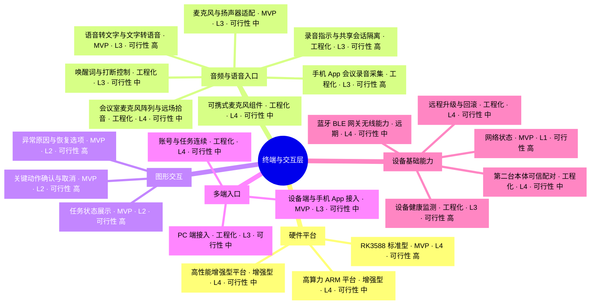
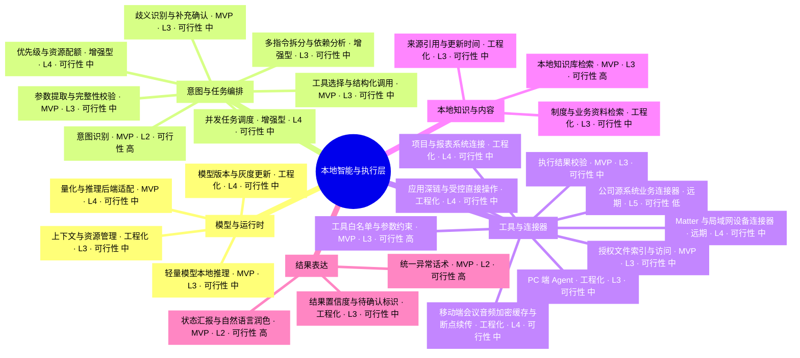
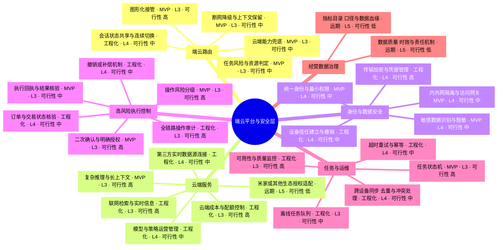
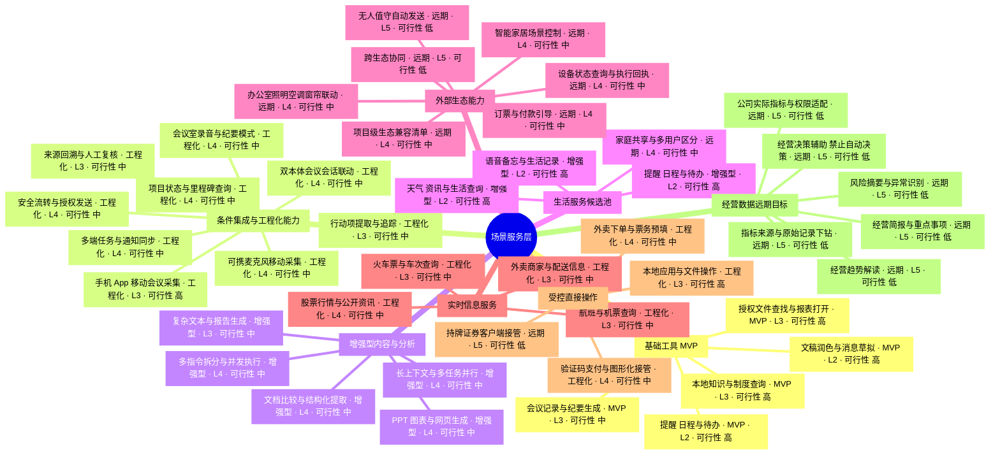
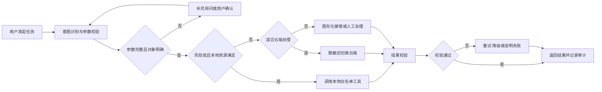

# 端云协同 AI 终端四层功能思维导图（修订版）

> 对齐《端云协同AI终端产品设计与选型方案》。首代以 RK3588 标准型为优先验证平台，围绕“本地工具执行 + 轻量语言交互 + 云端能力兜底”形成可演示、可试用、可度量的闭环。

## 标记说明

- 阶段标签：`MVP` 为首代必需；`工程化` 为稳定性、安全性与可维护性建设；`增强型` 为更高算力与更大内存平台的增量能力；`远期` 为生态依赖较强的候选能力。
- 实现难度：L1 配置集成；L2 常规开发；L3 多模块协同；L4 复杂系统集成；L5 高不确定性或强生态依赖。
- 可行性高：技术成熟、依赖和实现边界清楚；可行性中：可实现但需要硬件、系统、模型或业务接口验证；可行性低：存在明显的平台、权限、可靠性或生态限制。
- 评级口径：按真实产品交付评估，包含目标硬件适配、权限控制、异常恢复和结果验证，不以单次演示效果作为完成标准。

## 一、终端与交互层

## 二、本地智能与执行层

## 三、端云平台与安全层

## 四、场景服务层

## 首代 MVP 范围

首代不以功能数量为目标，优先冻结 3—5 个不依赖完整经营数据平台的高频工具。建议按以下顺序评审：

1. 授权文件查找与报表打开。
2. 本地知识与制度查询。
3. 会议记录与纪要生成。
4. 提醒、日程与待办。
5. 文稿润色与消息草拟。

每个 MVP 工具必须具备明确的数据边界、权限规则、成功判定、异常恢复和验收指标。订票、付款、删除、提交、控制设备和发送消息等具有外部影响的动作，不进入无人值守执行范围。

项目状态查询只有在上游系统接口和数据口径明确时进入工程化范围；经营简报、风险摘要、异常识别和趋势解读依赖配套数据系统与持续数据治理，仅作为远期方向。

智能空间方向可评估米家或其他生态的官方授权接口，以及本机蓝牙/BLE 网关、Matter 和局域网连接器。能力范围必须以硬件无线模块、协议栈、生态授权、认证和项目兼容清单为准；设备控制需读取真实状态和执行回执，高风险控制保留用户确认。

企业经营与决策信息必须结合公司的 ERP、CRM、财务、项目、供应链等实际系统开发。进入实施前需建立源系统连接器、数据平台或可信数据服务、指标目录、口径、权限、血缘、质量和责任机制；输出仅用于事实归集、异常提示和决策辅助，不替代治理程序或自动执行经营决策。

外卖、航班、火车票和股票查询优先通过云端实时数据源实现；下单、购票、支付和证券交易属于独立的受控操作能力，必须采用平台接口或图形化接管并保留用户最终确认。会议室模式和增强型多指令并发需分别完成现场与资源压力测试。

会议采集可优先使用手机 App，无需新增专用设备；可携式麦克风组件或第二台本体用于更高拾音质量、续航或独立运行要求。三种形态均需与办公室主机建立可信绑定，支持离线加密缓存、分片续传、完整性校验、片段去重、信任撤销和会后数据生命周期控制。手机 App 还需验证录音权限、来电与音频焦点中断、后台运行、电量、存储和网络切换。

## 端云任务闭环

## 阶段验收重点

| 阶段 | 核心验收重点 |
|---|---|
| MVP | 核心任务完成率、工具调用准确率、首字延迟与总耗时、关键操作确认覆盖率 |
| 工程化 | 异常可恢复率、敏感数据外发率、连续运行稳定性、权限与审计完整性、远程升级成功率 |
| 增强型 | 本地复杂任务质量、吞吐与资源占用、内容生成可编辑性、新增能力的付费价值 |
| 远期 | 智能空间按兼容清单验证授权、网关、状态查询、受控操作与失败回执；经营信息按公司实际系统验证指标口径、权限、质量、来源下钻和禁止自动决策；同时检查外部生态稳定性与责任边界 |
