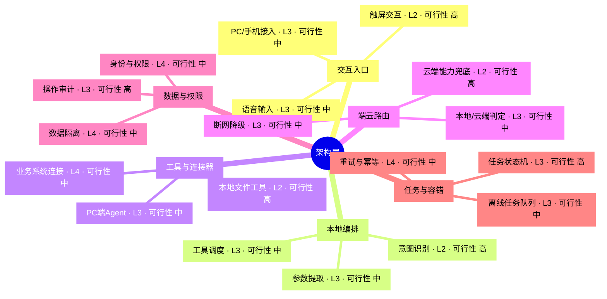
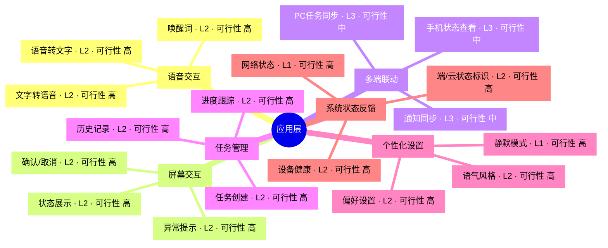
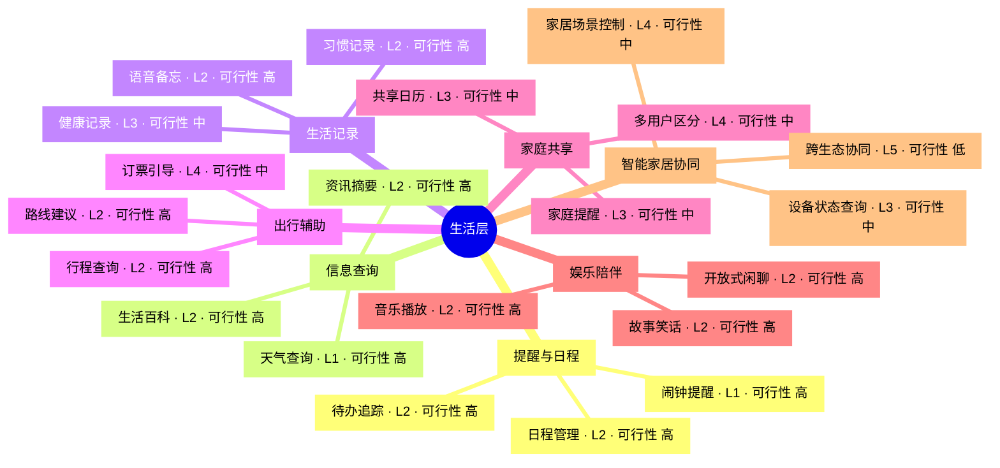
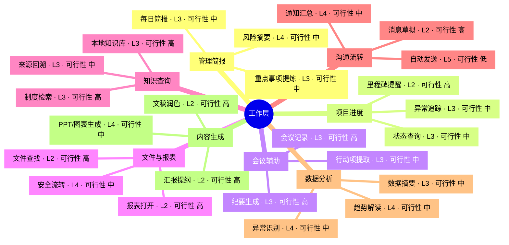

# 端云协同 AI 终端四层功能思维导图

## 评级说明

- 实现难度：L1 配置集成；L2 常规开发；L3 多模块协同；L4 复杂系统集成；L5 高不确定性或生态依赖。
- 可行性高：技术成熟、实现边界清楚。
- 可行性中：可以实现，但依赖适配或验证。
- 可行性低：存在明显的平台、权限、可靠性或生态限制。

## 架构层

```mermaid
mindmap
  arch((架构层))
    interaction[交互入口]
      arch_1[语音输入 · L3 · 可行性 中]
      arch_2[触屏交互 · L2 · 可行性 高]
      arch_3[PC/手机接入 · L3 · 可行性 中]
    orchestration[本地编排]
      arch_4[意图识别 · L2 · 可行性 高]
      arch_5[参数提取 · L3 · 可行性 中]
      arch_6[工具调度 · L3 · 可行性 中]
    connectors[工具与连接器]
      arch_7[本地文件工具 · L2 · 可行性 高]
      arch_8[业务系统连接 · L4 · 可行性 中]
      arch_9[PC端Agent · L3 · 可行性 中]
    routing[端云路由]
      arch_10[本地/云端判定 · L3 · 可行性 中]
      arch_11[云端能力兜底 · L2 · 可行性 高]
      arch_12[断网降级 · L3 · 可行性 中]
    permission[数据与权限]
      arch_13[身份与权限 · L4 · 可行性 中]
      arch_14[数据隔离 · L4 · 可行性 中]
      arch_15[操作审计 · L3 · 可行性 高]
    resilience[任务与容错]
      arch_16[任务状态机 · L3 · 可行性 高]
      arch_17[重试与幂等 · L4 · 可行性 中]
      arch_18[离线任务队列 · L3 · 可行性 中]
```

## 应用层

```mermaid
mindmap
  app((应用层))
    voice[语音交互]
      app_1[唤醒词 · L2 · 可行性 高]
      app_2[语音转文字 · L2 · 可行性 高]
      app_3[文字转语音 · L2 · 可行性 高]
    screen[屏幕交互]
      app_4[状态展示 · L2 · 可行性 高]
      app_5[确认/取消 · L2 · 可行性 高]
      app_6[异常提示 · L2 · 可行性 高]
    multi_terminal[多端联动]
      app_7[PC任务同步 · L3 · 可行性 中]
      app_8[手机状态查看 · L3 · 可行性 中]
      app_9[通知同步 · L3 · 可行性 中]
    task_management[任务管理]
      app_10[任务创建 · L2 · 可行性 高]
      app_11[进度跟踪 · L2 · 可行性 高]
      app_12[历史记录 · L2 · 可行性 高]
    personalization[个性化设置]
      app_13[偏好设置 · L2 · 可行性 高]
      app_14[语气风格 · L2 · 可行性 高]
      app_15[静默模式 · L1 · 可行性 高]
    system_feedback[系统状态反馈]
      app_16[网络状态 · L1 · 可行性 高]
      app_17[设备健康 · L2 · 可行性 高]
      app_18[端/云状态标识 · L2 · 可行性 高]
```

## 生活层

```mermaid
mindmap
  life((生活层))
    schedule[提醒与日程]
      life_1[闹钟提醒 · L1 · 可行性 高]
      life_2[日程管理 · L2 · 可行性 高]
      life_3[待办追踪 · L2 · 可行性 高]
    information[信息查询]
      life_4[天气查询 · L1 · 可行性 高]
      life_5[资讯摘要 · L2 · 可行性 高]
      life_6[生活百科 · L2 · 可行性 高]
    records[生活记录]
      life_7[语音备忘 · L2 · 可行性 高]
      life_8[习惯记录 · L2 · 可行性 高]
      life_9[健康记录 · L3 · 可行性 中]
    travel[出行辅助]
      life_10[行程查询 · L2 · 可行性 高]
      life_11[路线建议 · L2 · 可行性 高]
      life_12[订票引导 · L4 · 可行性 中]
    family[家庭共享]
      life_13[家庭提醒 · L3 · 可行性 中]
      life_14[共享日历 · L3 · 可行性 中]
      life_15[多用户区分 · L4 · 可行性 中]
    entertainment[娱乐陪伴]
      life_16[音乐播放 · L2 · 可行性 高]
      life_17[故事笑话 · L2 · 可行性 高]
      life_18[开放式闲聊 · L2 · 可行性 高]
    smart_home[智能家居协同]
      life_19[设备状态查询 · L3 · 可行性 中]
      life_20[家居场景控制 · L4 · 可行性 中]
      life_21[跨生态协同 · L5 · 可行性 低]
```

## 工作层

```mermaid
mindmap
  work((工作层))
    briefing[管理简报]
      work_1[每日简报 · L3 · 可行性 中]
      work_2[重点事项提炼 · L3 · 可行性 中]
      work_3[风险摘要 · L4 · 可行性 中]
    project[项目进度]
      work_4[状态查询 · L3 · 可行性 中]
      work_5[里程碑提醒 · L2 · 可行性 高]
      work_6[异常追踪 · L3 · 可行性 中]
    meeting[会议辅助]
      work_7[会议记录 · L3 · 可行性 高]
      work_8[纪要生成 · L3 · 可行性 高]
      work_9[行动项提取 · L3 · 可行性 中]
    documents[文件与报表]
      work_10[文件查找 · L2 · 可行性 高]
      work_11[报表打开 · L2 · 可行性 高]
      work_12[安全流转 · L4 · 可行性 中]
    knowledge[知识查询]
      work_13[本地知识库 · L3 · 可行性 高]
      work_14[制度检索 · L3 · 可行性 高]
      work_15[来源回溯 · L3 · 可行性 中]
    communication[沟通流转]
      work_16[通知汇总 · L4 · 可行性 中]
      work_17[消息草拟 · L2 · 可行性 高]
      work_18[自动发送 · L5 · 可行性 低]
    analysis[数据分析]
      work_19[数据摘要 · L3 · 可行性 中]
      work_20[异常识别 · L4 · 可行性 中]
      work_21[趋势解读 · L4 · 可行性 中]
    generation[内容生成]
      work_22[文稿润色 · L2 · 可行性 高]
      work_23[汇报提纲 · L2 · 可行性 高]
      work_24[PPT/图表生成 · L4 · 可行性 中]
```
